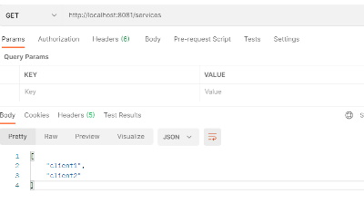
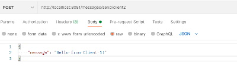
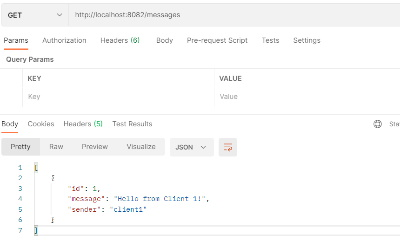

#Проект Spring Cloud Discovery Service
Приложение, выступающее в роли Discovery Server и приложения, которые будут передавать друг другу 
данные. URL для передачи клиенты будут запрашивать у Discovery Server. Все приложения будут запущены на localhost 
на разных портах.

Для реализации мы будем использовать Spring Cloud Eureka Server и Spring Cloud Eureka Client.

Запуск

1. Запускаем сервер

java
`mvn spring-boot:run`
2. Запускаем клиентов. Пути нужно указать свои. file:// необходимая часть. Далее идет абсолютный путь через /

Первого
`java -jar target/app.jar --spring.config.location=file:///c:/projects/job4j_discovery/client/cfg/client1.properties`

Второго
`java -jar target/app.jar --spring.config.location=file:///c:/projects/job4j_discovery/client/cfg/client2.properties`

3. Получаем информации о доступных клиентах

4. Отправляем и получаем сообщение

   

